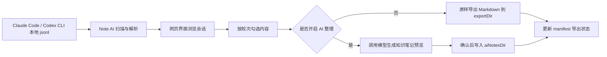

# Note AI · AI 对话档案

Note AI 是一个本地运行的 AI 对话整理工具。它会读取你电脑上 Claude Code 与 Codex CLI 生成的本地 `.jsonl` 会话记录，提供一个网页界面，让你按来源、日期和轮次挑选对话内容，再导出为适合 Obsidian 或其他 Markdown 笔记库使用的 `.md` 文件。

项目代号：**晨雾 / Misty**。

> 重点：源对话数据只读。工具不会写回 `.claude` 或 `.codex`，只会写入你配置的导出目录以及本项目本地状态文件。

## 功能概览

| 功能 | 说明 |
|---|---|
| 会话扫描 | 自动扫描 Claude Code 与 Codex CLI 的本地会话文件 |
| 来源切换 | 按 Claude / Codex 分类查看，点击后懒加载 |
| 时间筛选 | 支持近 7 天、近 30 天、全部会话 |
| 日期分组 | 会话列表按日期分组，标题来自首条真人提问 |
| 对话阅读 | 右侧按「第 N 轮 · 提问 / 回复」展示完整对话 |
| 块级勾选 | 提问和回复可以独立勾选，支持跨轮选择 |
| Markdown 导出 | 一键导出为带 front matter 的干净 Markdown |
| 已导出追踪 | 会话和块级别显示已导出状态，避免重复整理 |
| 思考过程开关 | 默认隐藏 Claude thinking 与 Codex `<think>` 内容，可手动打开 |
| AI 整理 | 支持 OpenAI 兼容接口，先预览 AI 生成的知识笔记，再确认写入 |
| 设置界面 | 可配置导出目录、知识笔记目录、模型接口、API Key、skill 路径等 |

## 适合谁用

- 经常使用 Claude Code / Codex CLI，想把高价值对话沉淀成笔记的人
- 用 Obsidian 管理知识库，希望把 AI 讨论、方案、代码解释归档的人
- 想从大量 AI 会话里筛选片段，而不是整段复制粘贴的人
- 想让 AI 按固定模板把对话整理成知识笔记的人

## 工作方式



## 技术栈

- 前端：React、Vite、Tailwind CSS、lucide-react
- 后端：Node.js 原生 HTTP 服务，TypeScript 源码直接运行
- 数据格式：Claude / Codex 本地 `.jsonl`
- AI 接口：OpenAI compatible 已实现；Anthropic / Ollama 预留同形接口
- 主要平台：Windows，本项目提供 `start.cmd` 一键启动脚本

## 目录结构

```text
03_note_ai/
├─ README.md
├─ start.cmd
├─ docs/
│  ├─ 00-进度与交接.md
│  ├─ 01-需求规格.md
│  ├─ 02-架构设计.md
│  ├─ 03-数据源与解析.md
│  ├─ 04-UI设计规范-晨雾.md
│  ├─ 05-导出与已导出追踪.md
│  ├─ 06-AI整理接口设计.md
│  ├─ 14-使用指南.md
│  ├─ 15-阶段7-AI真实接入-实现计划.md
│  └─ 16-缺陷修复记录.md
├─ server/
│  ├─ src/
│  ├─ test/
│  ├─ data/
│  │  └─ config.example.json
│  └─ package.json
└─ web/
   ├─ src/
   ├─ test/
   ├─ public/
   ├─ package.json
   └─ package-lock.json
```

## 环境要求

- Node.js >= 24
- npm
- Windows 10 / 11 推荐
- 本机已有 Claude Code 或 Codex CLI 会话记录

检查 Node 版本：

```powershell
node -v
```

如果版本低于 24，请先升级 Node.js。

## 安装

从 GitHub 克隆项目：

```powershell
git clone https://github.com/RyanChenJJH/note-AI.git
cd note-AI
```

安装后端依赖：

```powershell
cd server
npm install
cd ..
```

安装前端依赖：

```powershell
cd web
npm install
cd ..
```

> `server` 当前没有外部运行依赖，但保留 `npm install` 步骤是为了让后续依赖变更时流程稳定。`web` 会安装 Vite、React、TypeScript 等前端依赖。
> 如果 PowerShell 提示禁止加载 `npm.ps1`，把命令里的 `npm` 换成 `npm.cmd` 即可，例如 `npm.cmd install`。

## 快速启动

在项目根目录双击：

```text
start.cmd
```

它会自动完成：

1. 检查 `web/dist` 是否存在。
2. 如果不存在，进入 `web/` 执行 `npm run build`。
3. 启动后端服务。
4. 等待接口就绪。
5. 打开浏览器访问 `http://127.0.0.1:8787`。

也可以在 PowerShell 中手动运行：

```powershell
.\start.cmd
```

关闭工具时，关闭标题为 `AIDA-API` 的命令行窗口即可。

## 日常使用流程

1. 打开页面后进入主界面。
2. 在左侧选择来源：Claude 或 Codex。
3. 选择时间范围：近 7 天、近 30 天、全部。
4. 点击某条会话标题，在右侧查看完整内容。
5. 勾选需要导出的提问或回复块。
6. 选择导出方式：
   - AI 整理关闭：直接导出原始 Markdown。
   - AI 整理开启：先生成知识笔记预览，确认后写入。
7. 在导出成功提示中查看生成文件路径。

## 导出结果

普通导出会生成一篇 Markdown，包含 YAML front matter 和你勾选的对话块：

```markdown
---
source: codex
sessionId: 019e...
title: "我想了解 MCP 的原理"
project: "E:\\Work2\\..."
startedAt: 2026-06-01T10:23:11+08:00
exportedAt: 2026-06-03T09:00:00+08:00
rounds: [1, 2]
---

## 第 1 轮 · 提问

...

## 第 1 轮 · 回复

...
```

AI 整理导出会按照配置的 skill 生成一篇或多篇知识笔记。每篇笔记由模型返回自己的 front matter 和正文，确认后写入 `aiNotesDir`。

## 配置

本地配置文件路径：

```text
server/data/config.json
```

这个文件包含你的本机路径和 API Key，已经被 `.gitignore` 忽略，不应该提交到 GitHub。

你可以参考示例文件：

```text
server/data/config.example.json
```

字段说明：

| 字段 | 说明 |
|---|---|
| `exportDir` | AI 关闭时，原始对话 Markdown 的导出目录 |
| `aiNotesDir` | AI 整理确认后，知识笔记的写入目录 |
| `ai.enabled` | 是否默认启用 AI 整理 |
| `ai.provider` | provider 类型，目前可用值包括 `openai-compatible`、`anthropic`、`ollama` |
| `ai.baseUrl` | OpenAI 兼容接口地址，例如 DeepSeek 的 `https://api.deepseek.com/v1` |
| `ai.apiKey` | API Key，前端读取时会脱敏 |
| `ai.model` | 模型名称，例如 `deepseek-chat` |
| `ai.temperature` | 模型温度 |
| `ai.timeoutMs` | AI 请求超时时间，单位毫秒 |
| `ai.skillPath` | 整理 skill 根目录，目录内应能找到 `SKILL.md` |

也可以在网页右上角设置弹窗中修改这些配置。

## 环境变量

启动前可以用环境变量临时覆盖部分路径和端口：

```powershell
$env:AIDA_PORT = "9000"
$env:AIDA_EXPORT_DIR = "D:\Notes\AI-Inbox"
$env:AIDA_AI_NOTES_DIR = "D:\Notes\AI-Knowledge"
$env:AIDA_SKILL_DIR = "D:\Skills\chenao-note-ai"
$env:AIDA_CLAUDE_ROOT = "C:\Users\you\.claude\projects"
$env:AIDA_CODEX_ROOT = "C:\Users\you\.codex\sessions"
$env:AIDA_STATIC_DIR = "E:\path\to\web\dist"
$env:AIDA_MANIFEST = "D:\tmp\note-ai-manifest.json"
$env:AIDA_CONFIG = "D:\tmp\note-ai-config.json"
.\start.cmd
```

常用变量：

| 变量 | 说明 |
|---|---|
| `AIDA_PORT` | 后端端口，默认 `8787` |
| `AIDA_EXPORT_DIR` | 覆盖普通 Markdown 导出目录 |
| `AIDA_AI_NOTES_DIR` | 覆盖 AI 知识笔记目录 |
| `AIDA_SKILL_DIR` | 覆盖整理 skill 路径 |
| `AIDA_CLAUDE_ROOT` | 覆盖 Claude Code 会话根目录 |
| `AIDA_CODEX_ROOT` | 覆盖 Codex CLI 会话根目录 |
| `AIDA_STATIC_DIR` | 覆盖前端静态文件目录 |
| `AIDA_MANIFEST` | 覆盖已导出索引文件路径，常用于测试 |
| `AIDA_CONFIG` | 覆盖配置文件路径，常用于测试 |

注意：`start.cmd` 默认打开 `http://127.0.0.1:8787`。如果你改了 `AIDA_PORT`，需要手动访问新的端口，或同步修改脚本里的地址。

## AI 整理说明

AI 整理开启后，工具会把你勾选的对话块拼成 Markdown，并发送给配置的模型接口。模型会根据 `skillPath` 中的 `SKILL.md` 和参考模板生成知识笔记。

当前实现状态：

- `openai-compatible`：已实现，适合 DeepSeek、OpenAI 兼容代理等接口。
- `anthropic`：接口类型已预留，调用时会提示暂未实现。
- `ollama`：接口类型已预留，调用时会提示暂未实现。

隐私提示：开启联网模型时，所选对话内容会发送给你配置的第三方 API。涉及敏感内容时，请先确认服务提供商和网络环境可信。

AI 流程：

1. 勾选对话块。
2. 打开 AI 整理开关。
3. 点击整理按钮。
4. 等待模型返回一篇或多篇笔记。
5. 在预览弹窗中检查标题、文件名和正文。
6. 勾选要保留的笔记。
7. 点击确认写入。

如果 AI 未配置、超时、鉴权失败、skill 不存在或模型输出无法解析，前端会显示降级原因。此时可以关闭 AI 整理，按原样导出 Markdown。

## 开发模式

启动后端：

```powershell
cd server
npm run serve
```

启动前端开发服务器：

```powershell
cd web
npm run dev
```

浏览器打开：

```text
http://localhost:5173
```

Vite 会把 `/api` 代理到 `http://127.0.0.1:8787`。

## 常用命令

后端：

```powershell
cd server
npm run serve
npm test
npm run scan
npm run show -- <session-id>
npm run export -- <session-id> --blocks r1-q,r1-a --filename my-note
npm run verify -- <session-id>
```

前端：

```powershell
cd web
npm run dev
npm run build
npm run lint
npm run preview
```

## 测试

运行后端测试：

```powershell
cd server
npm test
```

运行前端构建检查：

```powershell
cd web
npm run build
```

如果需要执行前端 lint：

```powershell
cd web
npm run lint
```

## 本地状态文件

以下文件是本机状态或隐私配置，不会提交到 GitHub：

```text
server/data/config.json
server/data/manifest.json
server/data/_exports_test/
web/node_modules/
web/dist/
```

说明：

- `config.json`：本机路径、AI 配置、API Key。
- `manifest.json`：记录哪些会话块已经导出过。
- `_exports_test/`：CLI 或测试导出的临时文件。
- `node_modules/`：依赖安装目录。
- `web/dist/`：前端构建产物，可由 `npm run build` 重新生成。

## 数据源路径

默认扫描路径：

| 来源 | 默认路径 |
|---|---|
| Claude Code | `%USERPROFILE%\.claude\projects` |
| Codex CLI | `%USERPROFILE%\.codex\sessions` |

如果路径不同，可以用 `AIDA_CLAUDE_ROOT` 或 `AIDA_CODEX_ROOT` 覆盖。

## 常见问题

### 页面打不开

先确认后端是否启动成功。可以在 PowerShell 中运行：

```powershell
.\start.cmd
```

常见原因：

- Node.js 版本低于 24。
- 没有在 `web/` 下运行过 `npm install`。
- 端口 `8787` 被占用。
- `web/dist` 构建失败。

### 会话列表为空

可以检查：

- 本机是否确实有 Claude Code 或 Codex CLI 会话。
- 时间范围是否选到了「全部」。
- 是否选错来源。
- 会话根目录是否是默认路径。

如路径不一致，使用：

```powershell
$env:AIDA_CLAUDE_ROOT = "你的 Claude projects 路径"
$env:AIDA_CODEX_ROOT = "你的 Codex sessions 路径"
.\start.cmd
```

### 导出失败

常见原因：

- 导出目录没有写入权限。
- 配置里的路径不存在且无法自动创建。
- 文件名包含非法字符。工具会尽量替换非法字符，但极端路径仍可能失败。

### AI 整理不可用

检查：

- `ai.enabled` 是否开启。
- `ai.apiKey` 是否填写。
- `ai.baseUrl` 是否包含 `/v1`。
- `ai.model` 是否是服务商支持的模型名。
- `ai.skillPath` 下是否能找到 `SKILL.md`。
- 网络是否可访问配置的模型服务。

### 已导出标记想重置

删除本地文件：

```text
server/data/manifest.json
```

下次导出时会自动重新创建。

## 文档入口

- [使用指南](docs/14-使用指南.md)：面向使用者的完整操作说明。
- [需求规格](docs/01-需求规格.md)：项目目标、用户场景、功能需求。
- [架构设计](docs/02-架构设计.md)：模块拆分、数据流、接口。
- [数据源与解析](docs/03-数据源与解析.md)：Claude / Codex `.jsonl` 解析规则。
- [导出与已导出追踪](docs/05-导出与已导出追踪.md)：Markdown 与 manifest 设计。
- [AI 整理接口设计](docs/06-AI整理接口设计.md)：AI 接缝与配置设计。
- [阶段 7 AI 真实接入](docs/15-阶段7-AI真实接入-实现计划.md)：AI 预览、提交、多篇笔记实现说明。
- [缺陷修复记录](docs/16-缺陷修复记录.md)：已发现和修复的问题。

## 许可证

本项目基于 MIT License 开源。详情请见 [LICENSE](./LICENSE)。
